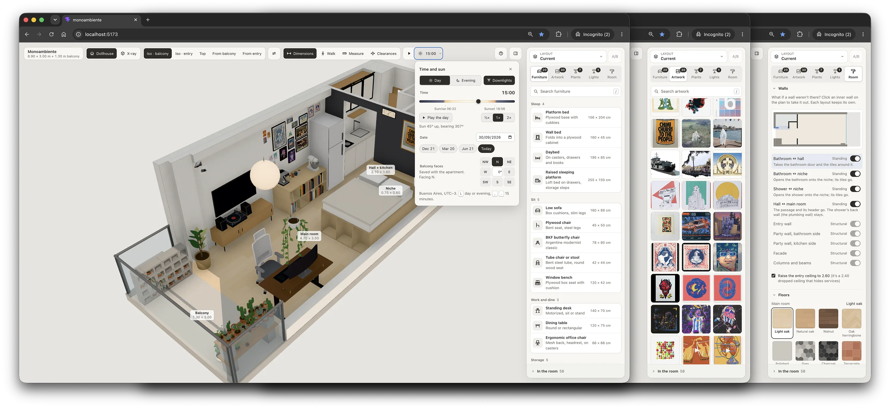
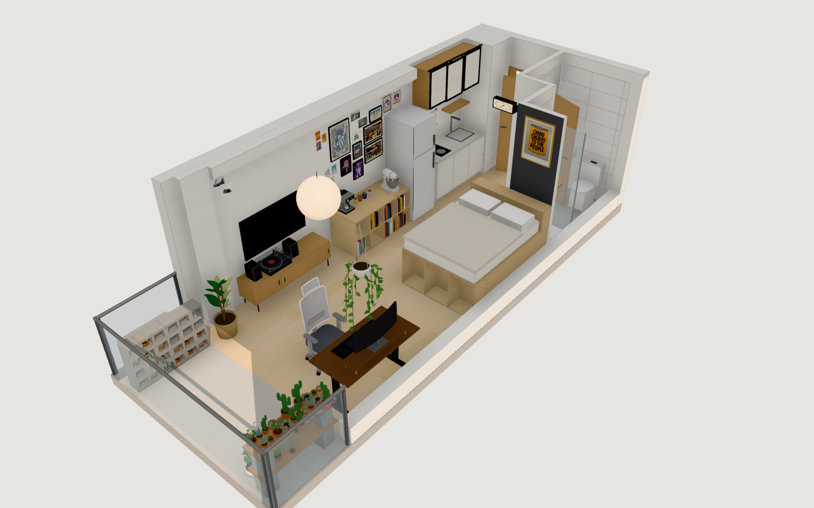
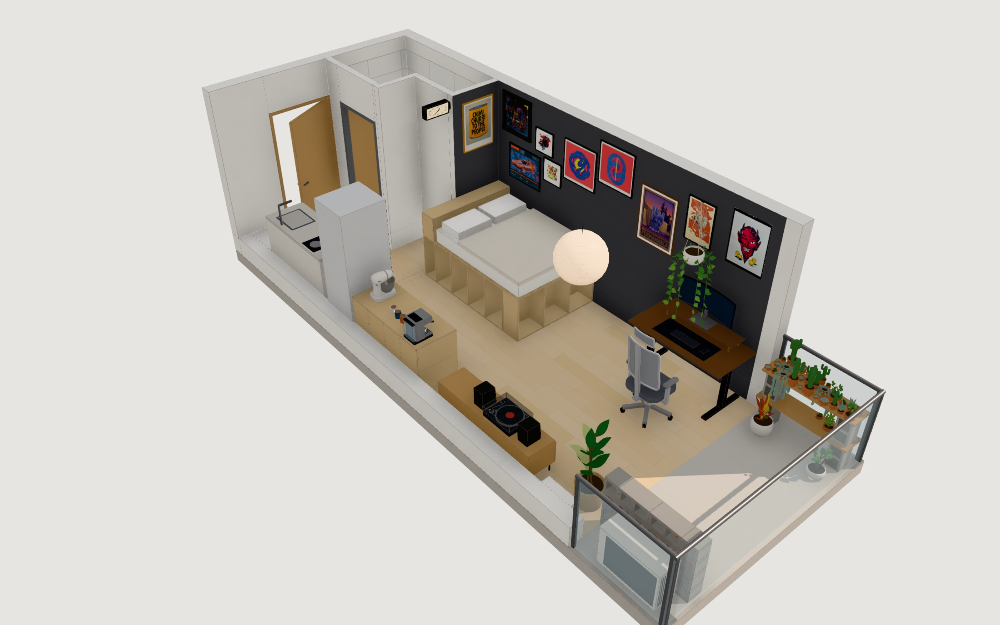

# Monoambiente

A real-time 3D model of a studio apartment, for planning the interior: hang artwork, place furniture, plants and lamps, try paint and floors, take a wall out, walk through it and watch the real sun move across the room.



<table>
  <tr>
    <td width="50%"></td>
    <td width="50%"></td>
  </tr>
</table>

```sh
pnpm install
pnpm dev            # http://localhost:5173
```

## Docs

- **[Model your own apartment](docs/your-own-floorplan.md)**: clone the repo, describe your place as a plan file, add your artwork and furnish it. Also covers how this could become a multi-user platform.
- **[Features](docs/features.md)**: views, the decor panel, layouts and finishes, keyboard shortcuts.
- **[Development](docs/development.md)**: project map, the dev API, tests, screenshot and performance tools.

## Plans and layouts

Each apartment is a plan file in `src/plans/<id>.plan.json` (type in `src/model/plan.ts`): its walls and openings, rooms, floors and ceilings, fixed fittings, materials, where it is (for the sun), and design rules: which partitions can come out, which walls take an accent color, which wall is the facade, a raisable dropped ceiling, and optional camera presets. Anything the file leaves out is derived from its geometry (`src/project/derived.ts`).

- `?plan=<id>` opens another plan; the default is set in `src/plans/default.ts`. `loft` is a small test plan in Madrid.
- A layout is a furnished version of a plan: `data/decor.json` for the default plan, `data/decor.<slug>.json` for named layouts and `data/decor.plan-<id>.json` for another plan's main layout. Layout files record their `plan`, so the layouts menu only lists the open plan's.
- The panel saves every change to the open layout, and editing the file by hand (or asking Claude to) updates open tabs live.
- `public/artwork/` is the image library. Uploads from the panel land here.

In this apartment, `x` runs from the inner face of the entry wall (0) to the balcony window (6.9), `z` from the bathroom side (0) to the kitchen side (3.0), and `y` is up.
