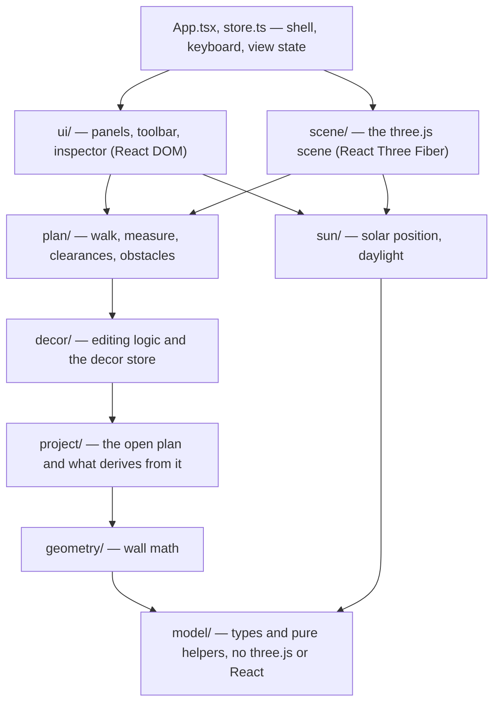
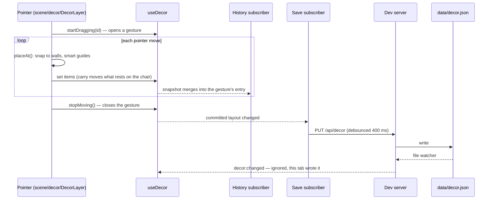

# Architecture

How the code is organized and why. For the words used here, see [GLOSSARY.md](../GLOSSARY.md); for the decisions behind the shape, see the [ADRs](adr/).

## In one paragraph

A **plan** (one apartment, a JSON file) is chosen when the page loads and everything about the apartment is derived from it. A **layout** (a furnished version of the plan, another JSON file) is loaded into the decor store, edited through the 3D scene and the panel, recorded in an undo history and saved back to disk through an API in the Vite dev server. The scene renders only when something changes.

## Layers

Dependencies point down. A module may import from its own layer or any layer below it, never above. `ui/` and `scene/` sit side by side: the panel may read scene constants (camera presets), but the scene never imports the panel.

| Layer | Owns | Notes |
|---|---|---|
| `model/` | The data types of plans, layouts, decor items and finishes, and pure functions on them (defaults, normalization). | No three.js, no React, no browser APIs. |
| `geometry/` | Wall frames and pieces between openings. | Pure. |
| `project/` | The open plan (`plan.ts`), values derived from it (`derived.ts`), the active shell (`structure.ts`), paint faces, finish materials, camera sides. | Reads `?plan=` once at load ([ADR 0002](adr/0002-plans-are-bundled-data.md)). |
| `sun/` | Where the sun is and what the light looks like. | Pure. |
| `plan/` | The apartment as obstacles: walk collision, clearances, the measure tool and its store. | Uses decor placement to know furniture footprints. |
| `decor/` | Everything about editing decor that is not drawing it: the store, placement and snapping, smart guides, arranging, carrying, selection commands, catalogs, the layouts API client. | May use three.js math and raycasting, never React components. |
| `scene/` | Drawing: walls, floors, fixtures, lights, shadows, every decor model, pointer handling in the scene. | |
| `ui/` | Everything in the DOM around the canvas. | |
| `server/` | The dev API: layout files, artwork uploads, a remote image proxy. | Runs in Node under `pnpm dev` only ([ADR 0001](adr/0001-dev-server-is-the-backend.md)). |

## State

State is split into zustand stores by how long it lives ([ADR 0004](adr/0004-stores-split-by-lifetime.md)). The one to know is `useDecor` in `src/decor/store.ts`: everything in it is saved to the layout file and recorded in history, so transient editing state (hover, snapping, guides) lives in `useEdit` instead.

Components subscribe to the narrowest slice they need, so dragging an item re-renders the inspector for that item and nothing else in the panel.

## Life of an edit

Dragging a chair across the room:

1. **Pointer.** `DecorLayer` raycasts the scene, finds the surface under the pointer and asks `decor/placement.ts` where the item would go there, then `decor/guides.ts` for smart-guide snapping.
2. **Store.** The store writes the new items. Every write passes through `carry()`, so things resting on a moved piece move with it.
3. **History.** A subscriber compares the committed layout with the last snapshot and pushes or merges an undo entry ([ADR 0005](adr/0005-undo-by-snapshots.md)).
4. **Save.** Another subscriber serializes the committed layout ([ADR 0003](adr/0003-layout-file-format.md)) and saves it after a short pause.
5. **Echo.** The dev server's file watcher announces the change to every tab. A tab ignores its own writes and reloads anyone else's, so a hand edit to the file shows up live.

## Startup

1. `src/project/plan.ts` picks the plan from `?plan=`; `project/derived.ts` computes cameras, bounds and defaults from it.
2. Stores initialize from the URL and browser storage: `?view`, `?sun`, `?decor` and friends, so a URL can reproduce a view exactly (the screenshot scripts rely on this).
3. `App` mounts the scene and the panel and calls `useDecor.load()`, which fetches the layout. Without the dev API (a static build) the app starts empty and says saving is unavailable.

## Rendering

The canvas renders on demand, shadow maps update only on request, and static geometry is merged per material ([ADR 0006](adr/0006-render-on-demand.md)). Code that changes the scene outside React must call `invalidate()`; code that moves geometry must call `requestShadowUpdate()`.

Walls come from the active shell ([ADR 0008](adr/0008-structure-as-layout-data.md)), never the plan's shell directly. Decor models are parametric components ([ADR 0007](adr/0007-parametric-furniture.md)).

## Testing

| Level | Where | What it covers |
|---|---|---|
| Unit | `tests/unit/` (vitest, jsdom) | Pure logic: geometry, placement, guides, arranging, carry, solar math, catalogs, the store's history and saving, the dev API. |
| Browser | `tests/e2e/` (Playwright scripts) | The app in Chrome against a running dev server, on scratch layouts that never touch real ones. |
| Visual | `scripts/` | Screenshots, sun studies and performance numbers, checked by eye. |

`pnpm check` runs the unit level plus types, lint and format; CI runs it on every push and pull request.

## Known gaps

Tracked here until they are fixed:

- `src/decor/store.ts` mixes selection, clipboard, history, persistence and layout switching, and its actions pass undo merge keys through a module variable.
- Plan and layout files are cast to their types without validation.
- `model/finishes.ts` and `model/structure.ts` read the open plan (accent walls, removable partitions), so the model layer is not independent of `project/`.
- `scene/decor/DecorLayer.tsx` reads the paint brush from the UI store; the brush is editing state and belongs with `useEdit`.
- URL parameters are read in several modules at import.
- Layout file naming rules exist on both the client and the server.
- Browser tests are plain scripts rather than a test runner, and only the smoke test runs from `pnpm test:e2e`.
